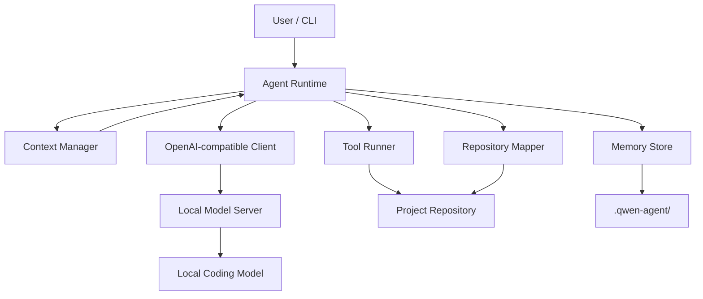

# ContextOS

[繁體中文](README.zh-TW.md) · English

> **Make task lifetime independent from context-window lifetime.**

ContextOS is an experimental, persistent context and memory runtime for long-running local coding agents. It sits in front of an OpenAI-compatible local model server, externalizes volatile agent state, and rebuilds working context when conversation history becomes too large.

[](https://github.com/HayronHgh/context-os/actions/workflows/ci.yml)
[](LICENSE)
[](#status)

## Why

Most local agents implicitly assume:

```text
conversation history = memory
```

That breaks down during long coding tasks. Test logs, repeated file reads, stale tool output, and old reasoning consume the context window. FIFO context shifting cannot tell an architecture decision from disposable compiler output.

ContextOS uses a different model:

```text
Repository       = Source of truth
Persistent State = Long-term memory
Prompt Context   = Materialized working view
KV Cache         = Compute optimization
```

The goal is simple: a conversation may be compacted or reset without killing the task.

## Status

**Experimental · Phase 1/2 research MVP · Windows-first**

Tested with:

- llama.cpp server, OpenAI-compatible chat/tool API
- Qwen3.6-35B-A3B GGUF
- Windows 11, Node.js 24, NVIDIA CUDA
- 64K active context, 8K agent output, 4K reasoning budget

The runtime is not tied to a specific model name, but the backend must return OpenAI-style chat messages and tool calls. Other models and servers are not yet part of the test matrix.

## Features

- Persistent working state across conversations
- Human-editable project memory
- Structured episodic memory
- Repository file/symbol map
- Tool output externalization into durable artifacts
- Five-stage context budget and compaction policy
- Structured Coding State Transfer instead of generic summaries
- OpenAI-compatible tool-calling loop
- Project-root path containment for file tools
- Approval prompts for writes, edits, and shell commands
- Destructive-command guardrails
- Windows start, stop, diagnostics, setup, and resumable model download scripts
- Zero runtime npm dependencies

## Architecture



The `.qwen-agent` directory name is retained for compatibility with the original MVP. A neutral on-disk namespace is planned before a stable release.

## Quick start

### Requirements

- Windows 10/11
- Node.js 20 or newer
- A recent `llama-server.exe`
- A tool-capable GGUF model
- Enough RAM/VRAM for your model and context size

### 1. Clone

```powershell
git clone https://github.com/HayronHgh/context-os.git
cd context-os
```

### 2. Create local configuration

Double-click `00_setup.bat`, or run:

```powershell
npm run setup
```

This creates ignored local files:

```text
config/agent.json
config/server.json
```

Edit `config/server.json` and point `executable` and `model` to your local files. Keep `config/agent.json.model` equal to `config/server.json.alias`.

### 3. Diagnose and start

```text
04_health_check.bat
01_start_server.bat
02_start_agent.bat
```

To work on another repository:

```bat
02_start_agent.bat "C:\path\to\your\repository"
```

Stop the managed server with `03_stop_server.bat`.

## Agent commands

| Command | Purpose |
| --- | --- |
| `/health` | Check server and loaded model |
| `/map` | Rebuild the repository map |
| `/state` | Show persistent working state |
| `/memory` | Show project memory |
| `/compact` | Force Coding State Transfer |
| `/new` | Reset conversation, retain persistent state |
| `/project` | Show the active project root |
| `/exit` | Exit the CLI |

## Tools

The model can request 11 runtime-managed tools:

```text
read_file             file_glob_search
grep_search           write_file
edit_file             run_command
build_repo_map        read_working_state
update_working_state  save_episode
get_datetime
```

File writes, edits, and shell commands require approval by default.

## Persistent state

Each target repository receives:

```text
.qwen-agent/
├── state.json
├── project.md
├── repo-map.json
├── episodes/
├── artifacts/
└── sessions/
```

| State | Purpose | Commit? |
| --- | --- | --- |
| `project.md` | Shared architecture and conventions | Optional |
| `state.json` | Current task state | No |
| `repo-map.json` | Generated repository index | No |
| `episodes/` | Solved-problem memory | No |
| `artifacts/` | Full tool output | No |
| `sessions/` | Conversation/tool event log | No |

## Context policy

Input budget is `contextWindow - reservedOutputTokens`.

| Utilization | Action |
| ---: | --- |
| 55% | Garbage-collect stale tool output |
| 65% | Prune stale conversation results |
| 72% | Generate structured Coding State Transfer |
| 80% | Force hard state transfer |
| 90% | Stop instead of silently losing state |

Full tool output remains available in `.qwen-agent/artifacts/` after its prompt representation is shortened.

## Security

> [!WARNING]
> ContextOS is an experimental coding-agent runtime. Shell execution is **not sandboxed**.

- Do not use `--yes` on untrusted repositories.
- `run_command` executes with your current user permissions after approval.
- Deny lists cannot cover every destructive shell expression.
- `.qwen-agent` may contain source code, command output, paths, or secrets.
- Use a VM, container, or disposable account for untrusted code.
- The default server binds to localhost; do not expose it to a LAN without authentication, TLS, firewall rules, and a stricter threat model.

Read [docs/SECURITY.md](docs/SECURITY.md) before using the runtime on important repositories.

## What makes this different?

ContextOS is not trying to be a complete IDE or another general-purpose coding assistant. Its research question is narrower:

> Can a local coding agent survive context resets and continue a long-running task using externalized state?

The project treats context lifecycle as a first-class system problem: tool artifacts are externalized, task state is durable, and working context can be rematerialized after compaction or reset.

## Current limitations

- Approximate token counting, not tokenizer-exact accounting
- Regex-based symbol extraction, not AST/LSP intelligence
- Recent-only episode retrieval
- Non-streaming chat completions
- File-based persistence, no transactional database
- No strong OS sandbox
- Single coordinator, no multi-agent think tank
- Windows-first management scripts

## Roadmap

- Metrics and a Context Recovery Benchmark
- Schema-validated state extraction
- Session replay and state diffs
- tree-sitter and LSP repository intelligence
- SQLite FTS5/BM25 retrieval
- Optional semantic memory retrieval
- Streaming responses
- Stronger isolation options
- Clean-context investigator/architect/reviewer agents

## Documentation

| English | 繁體中文 |
| --- | --- |
| [Architecture](docs/ARCHITECTURE.md) | [系統架構](docs/ARCHITECTURE.zh-TW.md) |
| [Context compression](docs/CONTEXT_COMPRESSION.md) | [Context 壓縮](docs/CONTEXT_COMPRESSION.zh-TW.md) |
| [Memory model](docs/MEMORY_MODEL.md) | [記憶模型](docs/MEMORY_MODEL.zh-TW.md) |
| [Security](docs/SECURITY.md) | [安全說明](docs/SECURITY.zh-TW.md) |
| [Tutorial](docs/TUTORIAL.md) | [完整教程](docs/TUTORIAL.zh-TW.md) |
| [Technical report](docs/TECHNICAL_REPORT.md) | [技術報告](docs/TECHNICAL_REPORT.zh-TW.md) |

## Development

```powershell
node --test
node src/index.js --help
```

The runtime uses only Node.js built-in modules.

## License

[MIT](LICENSE)
