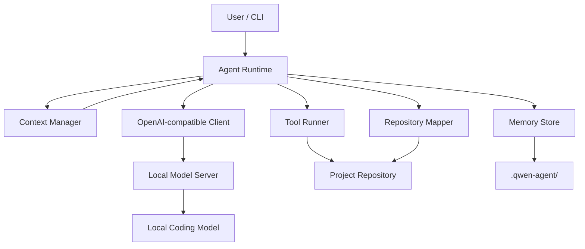

# ContextOS

[繁體中文](README.zh-TW.md) · English

> **Make task lifetime independent from context-window lifetime.**

ContextOS is an experimental, persistent context and memory runtime for long-running local coding agents. It sits in front of an OpenAI-compatible local model server, externalizes volatile agent state, and rebuilds working context when conversation history becomes too large.

[](https://github.com/HayronHgh/context-os/actions/workflows/ci.yml)
[](LICENSE)
[](#status)

## Why

Most local agents implicitly assume:

```text
conversation history = memory
```

That breaks down during long coding tasks. Test logs, repeated file reads, stale tool output, and old reasoning consume the context window. FIFO context shifting cannot tell an architecture decision from disposable compiler output.

ContextOS uses a different model:

```text
Repository       = Mutable source of truth
Artifact         = Durable tool evidence
State Transfer   = Derived continuation state
Prompt Context   = Disposable working view
```

The goal is simple: a conversation may be compacted or reset without killing the task.

## Status

**Experimental · v0.2.0-dev.5 D0-D6 Execution Finalization · Windows-first**

The deterministic control remains frozen at [`v0.1.2`](https://github.com/HayronHgh/context-os/tree/v0.1.2), and M4 experiment inputs are pinned to `aa59f4d`. The v0.2 development line now reaches model-free execution finalization: D5 atomically commits the exact validated context, then D6 generation-binds that commit, rebuilds the existing Context Inventory registry, and uses the same canonical ContextManager estimator and tool envelope to report signed actual reduction. Artifact creation and memory promotion remain absent.

Tested with:

- llama.cpp server, OpenAI-compatible chat/tool API
- Qwen3.6-35B-A3B GGUF
- Windows 11, Node.js 24, NVIDIA CUDA
- 64K active context, 8K agent output, 4K reasoning budget
- v0.1.2 `read_file -> artifact -> read_artifact` end-to-end recovery path

The runtime is not tied to a specific model name, but the backend must return OpenAI-style chat messages and tool calls. Other models and servers are not yet part of the test matrix.

## Features

- Persistent working state across conversations
- Human-editable project memory
- Structured episodic memory
- Repository file/symbol map
- Tool output externalization into durable artifacts
- Recovery-gated tool-output compression and exchange eviction
- Bounded artifact retrieval with SHA-256 integrity checking
- Tool-schema-aware, five-level context pressure policy
- Schema-validated Coding State Transfer instead of generic summaries
- OpenAI-compatible tool-calling loop
- Stable-ID Context Units with explicit authority, recoverability, protection, dependencies, and lifecycle
- Bounded observational Context Inventory kept behind the model serialization boundary
- Canonical inventory SHA-256 identity that rejects stale plan bindings
- Strict CompactionPlan parser with default KEEP and proposal-only actions
- Model-free FakePlanner and valid/invalid protocol fixtures
- Runtime-owned protection, authority, recoverability, and transitive dependency authorization
- Distinct, side-effect-free ValidatedPlan with potential upper-bound token accounting
- Bounded PlannerInventoryView with global input, unit, visibility, and output limits
- Isolated tool-free Qwen Planner with versioned prompt and one strict repair attempt
- Visible-only proposal binding, deterministic fallback, session audit, PAR/IPR metrics
- M4 freeze manifest covering planner-v1, Planner input/budgets, M2, M3, and Planner metrics
- Read-only artifact, repository, memory, and rebuildable recovery-source verification
- Strict `ValidatedPlan` admission gate and distinct deep-frozen `ExecutablePlan`
- Runtime-owned source/candidate SHA-256 binding and deterministic non-COMPRESS candidates
- Isolated tool-free `transformer-v1` COMPRESS generation with one schema-only repair
- Whole-plan immutable `TransformationCandidate` with no execution authority
- Runtime-first post-transform gates for exact binding, digests, token estimates, operation rules, and compression targets
- Isolated tool-free `transform-validator-v1` semantic preservation assessment for COMPRESS only
- Whole-plan immutable `ValidatedTransformation`; any mechanical or semantic failure rejects everything
- Model-free D5 pre-commit revalidation of the complete Validation/Candidate/Plan/Inventory chain
- Single-use, generation-guarded Atomic Executor with whole-plan clone/build and one reference-swap commit
- Immutable `ExecutionResult`; stale context, recovery drift, or any build failure aborts without partial mutation
- Post-commit D6 finalization bound to the exact committed context generation
- Existing-registry Context Inventory rebuild with stable IDs and inactive removed units
- Canonical before/after ContextManager accounting with identical tools/overhead and signed actual reduction
- Immutable `ExecutionReport`; finalization failure never rewrites D5 as aborted or rolls back its commit
- Real-path-aware project-root containment for file and artifact tools
- Approval prompts for writes, edits, and shell commands
- Destructive-command guardrails
- Windows start, stop, diagnostics, setup, and resumable model download scripts
- Zero runtime npm dependencies

## Architecture



The `.qwen-agent` directory name is retained for compatibility with the original MVP. A neutral on-disk namespace is planned before a stable release.

## Quick start

### Requirements

- Windows 10/11
- Node.js 20 or newer
- A recent `llama-server.exe`
- A tool-capable GGUF model
- Enough RAM/VRAM for your model and context size

### 1. Clone

```powershell
git clone https://github.com/HayronHgh/context-os.git
cd context-os
```

### 2. Create local configuration

Double-click `00_setup.bat`, or run:

```powershell
npm run setup
```

This creates ignored local files:

```text
config/agent.json
config/server.json
```

Edit `config/server.json` and point `executable` and `model` to your local files. Keep `config/agent.json.model` equal to `config/server.json.alias`.

### 3. Diagnose and start

```text
04_health_check.bat
01_start_server.bat
02_start_agent.bat
```

To work on another repository:

```bat
02_start_agent.bat "C:\path\to\your\repository"
```

Stop the managed server with `03_stop_server.bat`.

## Agent commands

| Command | Purpose |
| --- | --- |
| `/health` | Check server and loaded model |
| `/map` | Rebuild the repository map |
| `/state` | Show persistent working state |
| `/memory` | Show project memory |
| `/inventory` | Inspect the current Context Unit inventory |
| `/compact` | Force Coding State Transfer |
| `/new` | Reset conversation, retain persistent state |
| `/project` | Show the active project root |
| `/exit` | Exit the CLI |

## Tools

The model can request 12 runtime-managed tools:

```text
read_file             file_glob_search
grep_search           write_file
edit_file             run_command
build_repo_map        read_working_state
read_artifact         update_working_state
save_episode          get_datetime
```

File writes, edits, and shell commands require approval by default.

## Persistent state

Each target repository receives:

```text
.qwen-agent/
├── state.json
├── project.md
├── repo-map.json
├── episodes/
├── artifacts/
└── sessions/
```

| State | Purpose | Commit? |
| --- | --- | --- |
| `project.md` | Shared architecture and conventions | Optional |
| `state.json` | Current task state | No |
| `repo-map.json` | Generated repository index | No |
| `episodes/` | Solved-problem memory | No |
| `artifacts/` | Full tool output | No |
| `sessions/` | Conversation/tool event log | No |

## Context pressure policy

Input budget is `contextWindow - reservedOutputTokens`. Utilization includes messages, the complete tool-definition payload, `tool_choice`, and a configurable fixed chat-template safety margin.

| Utilization | Action |
| ---: | --- |
| 55% | Compress stale, oversized tool output |
| 65% | Evict complete stale tool-call/result exchanges |
| 72% | Compact older turns into structured Coding State Transfer |
| 80% | Force transfer and retain only the latest user work window |
| 90% | Stop instead of silently losing state |

ContextOS never destructively compresses tool evidence at 55%, or evicts a complete tool exchange at 65%, unless every affected result has a durable artifact recovery path. Non-durable evidence stays in context and the runtime records the blocked eviction. Semantic and hard State Transfer retain their v0.1.1 deterministic behavior.

Tool results above `artifactPersistenceChars` are persisted independently of prompt rendering. Large prompt representations are bounded by `maxToolOutputChars`; exact content remains available through `read_artifact`.

## Security

> [!WARNING]
> ContextOS is an experimental coding-agent runtime. Shell execution is **not sandboxed**.

- Do not use `--yes` on untrusted repositories.
- `run_command` executes with your current user permissions after approval.
- Deny lists cannot cover every destructive shell expression.
- `.qwen-agent` may contain source code, command output, paths, or secrets.
- Use a VM, container, or disposable account for untrusted code.
- The default server binds to localhost; do not expose it to a LAN without authentication, TLS, firewall rules, and a stricter threat model.

Read [docs/SECURITY.md](docs/SECURITY.md) before using the runtime on important repositories.

## What makes this different?

ContextOS is not trying to be a complete IDE or another general-purpose coding assistant. Its research question is narrower:

> Can a local coding agent survive context resets and continue a long-running task using externalized state?

The project treats context lifecycle as a first-class system problem: tool artifacts are externalized, task state is durable, and working context can be rematerialized after compaction or reset.

## Current limitations

- Approximate token counting, not tokenizer-exact accounting
- Regex-based symbol extraction, not AST/LSP intelligence
- Recent-only episode retrieval
- Non-streaming chat completions
- File-based persistence, no transactional database
- No strong OS sandbox
- Single coordinator, no multi-agent think tank
- Windows-first management scripts

## Roadmap

- **v0.1.2:** deterministic durability and Phase 1/2 core freeze
- **v0.2.0:** Adaptive Semantic Context Planning research and threshold/semantic/hybrid benchmark
- **v0.3.0:** tree-sitter, LSP, Git, and repository graph intelligence
- **v0.4.0:** SQLite FTS5/BM25, graph retrieval, and optional semantic fallback
- **v0.5.0:** clean-context investigator/architect/reviewer think tank

After v0.1.2, the 0.1.x line accepts only critical bugs, security fixes, regressions, and documentation corrections. New memory architecture, context policy, repository intelligence, agents, and retrieval engines belong to 0.2+.

## Documentation

| English | 繁體中文 |
| --- | --- |
| [Architecture](docs/ARCHITECTURE.md) | [系統架構](docs/ARCHITECTURE.zh-TW.md) |
| [Context compression](docs/CONTEXT_COMPRESSION.md) | [Context 壓縮](docs/CONTEXT_COMPRESSION.zh-TW.md) |
| [Memory model](docs/MEMORY_MODEL.md) | [記憶模型](docs/MEMORY_MODEL.zh-TW.md) |
| [Security](docs/SECURITY.md) | [安全說明](docs/SECURITY.zh-TW.md) |
| [Tutorial](docs/TUTORIAL.md) | [完整教程](docs/TUTORIAL.zh-TW.md) |
| [Technical report](docs/TECHNICAL_REPORT.md) | [技術報告](docs/TECHNICAL_REPORT.zh-TW.md) |
| [CompactionPlan protocol](docs/COMPACTION_PLAN_PROTOCOL.md) | [CompactionPlan protocol](docs/COMPACTION_PLAN_PROTOCOL.zh-TW.md) |
| [Compaction authorization](docs/COMPACTION_VALIDATION.md) | [Compaction authorization](docs/COMPACTION_VALIDATION.zh-TW.md) |
| [Bounded semantic planning](docs/BOUNDED_SEMANTIC_PLANNING.md) | [Bounded semantic planning](docs/BOUNDED_SEMANTIC_PLANNING.zh-TW.md) |
| [Execution contract](docs/EXECUTION_CONTRACT.md) | [Execution contract](docs/EXECUTION_CONTRACT.zh-TW.md) |
| [RFC-001: Adaptive Context Planning](docs/rfcs/RFC-001-ADAPTIVE-CONTEXT-PLANNING.md) | [RFC-001：自適應 Context Planning](docs/rfcs/RFC-001-ADAPTIVE-CONTEXT-PLANNING.zh-TW.md) |

## Development

```powershell
node --test
node src/index.js --help
```

The runtime uses only Node.js built-in modules.

## License

[MIT](LICENSE)
