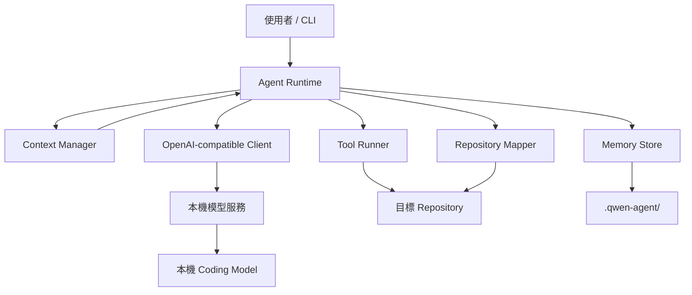

# ContextOS

繁體中文 · [English](README.md)

> **讓任務壽命不再受限於 context window 壽命。**

ContextOS 是一個實驗性的本機 coding-agent 持久 context 與記憶 Runtime。它位於 OpenAI-compatible 本機模型服務之前，將容易消失的 Agent 狀態外部化，並在 conversation 過大時重新組成可工作的 context。

[](https://github.com/HayronHgh/context-os/actions/workflows/ci.yml)
[](LICENSE)
[](#目前狀態)

## 為什麼需要它？

許多本機 Agent 隱含地假設：

```text
conversation history = memory
```

長時間 coding 任務會讓這個假設失效。測試 log、重複讀檔、過期工具結果與舊 reasoning 會占滿 context；FIFO context shift 也無法判斷架構決策比 compiler output 更重要。

ContextOS 採用不同模型：

```text
Repository       = Source of truth
Persistent State = 長期記憶
Prompt Context   = 具體化的工作視圖
KV Cache         = 計算加速快取
```

目標很簡單：conversation 可以被壓縮或重設，但任務不能因此死亡。

## 目前狀態

**Experimental · Phase 1/2 Research MVP · Windows-first**

已驗證環境：

- llama.cpp server 與 OpenAI-compatible chat/tool API
- Qwen3.6-35B-A3B GGUF
- Windows 11、Node.js 24、NVIDIA CUDA
- 64K active context、8K Agent output、4K reasoning budget

Runtime 沒有綁死特定模型名稱，但 backend 必須回傳 OpenAI-style chat messages 與 tool calls。其他模型與 server 尚未納入正式測試矩陣。

## 功能

- 跨 conversation 的持久 working state
- 可人工編輯的 project memory
- 結構化 episodic memory
- Repository file/symbol map
- Tool output artifact 外部化
- 五段式 context budget 與壓縮策略
- 使用 Coding State Transfer，而不是普通摘要
- OpenAI-compatible tool-calling loop
- File tools 的 project-root 路徑限制
- 寫檔、編輯與 shell command 人工確認
- 破壞性命令 guardrails
- Windows setup、啟停、診斷與可續傳模型下載
- Runtime 零 npm dependency

## 架構



`.qwen-agent` 目錄名稱為相容初版 MVP 而保留；穩定版前預計改為中性 namespace。

## 快速開始

### 需求

- Windows 10/11
- Node.js 20 以上
- 近期版本的 `llama-server.exe`
- 支援工具呼叫的 GGUF model
- 足以載入模型與 context 的 RAM/VRAM

### 1. Clone

```powershell
git clone https://github.com/HayronHgh/context-os.git
cd context-os
```

### 2. 建立本機設定

雙擊 `00_setup.bat`，或執行：

```powershell
npm run setup
```

它會產生不提交 Git 的：

```text
config/agent.json
config/server.json
```

編輯 `config/server.json`，填入本機 `llama-server.exe` 與 GGUF 路徑。`config/agent.json.model` 必須等於 `config/server.json.alias`。

### 3. 診斷與啟動

```text
04_health_check.bat
01_start_server.bat
02_start_agent.bat
```

操作其他 repository：

```bat
02_start_agent.bat "C:\path\to\your\repository"
```

使用 `03_stop_server.bat` 停止本專案管理的 server。

## Agent 指令

| 指令 | 用途 |
| --- | --- |
| `/health` | 檢查 server 與 model |
| `/map` | 重建 repository map |
| `/state` | 顯示 working state |
| `/memory` | 顯示 project memory |
| `/compact` | 強制 Coding State Transfer |
| `/new` | 清除 conversation、保留持久狀態 |
| `/project` | 顯示目前 project root |
| `/exit` | 離開 CLI |

## 工具

模型可要求 11 個由 Runtime 管理的工具：

```text
read_file             file_glob_search
grep_search           write_file
edit_file             run_command
build_repo_map        read_working_state
update_working_state  save_episode
get_datetime
```

寫檔、編輯與 shell command 預設需要人工同意。

## 持久狀態

每個目標 repository 都會建立：

```text
.qwen-agent/
├── state.json
├── project.md
├── repo-map.json
├── episodes/
├── artifacts/
└── sessions/
```

| 狀態 | 用途 | 建議提交？ |
| --- | --- | --- |
| `project.md` | 團隊共享的架構與慣例 | 選擇性 |
| `state.json` | 目前任務狀態 | 否 |
| `repo-map.json` | 自動產生的索引 | 否 |
| `episodes/` | 已解決問題記憶 | 否 |
| `artifacts/` | 完整工具輸出 | 否 |
| `sessions/` | Conversation/tool event log | 否 |

## Context 策略

有效 input budget 為 `contextWindow - reservedOutputTokens`。

| 使用率 | 行為 |
| ---: | --- |
| 55% | 清理過期 tool output |
| 65% | Prune 過期 conversation 結果 |
| 72% | 產生結構化 Coding State Transfer |
| 80% | 強制 hard state transfer |
| 90% | 停止，避免靜默遺失狀態 |

即使 prompt 中的工具結果被縮短，完整輸出仍保留在 `.qwen-agent/artifacts/`。

## 安全

> [!WARNING]
> ContextOS 是實驗性 coding-agent Runtime。Shell execution **沒有 sandbox**。

- 不要對不可信任的 repository 使用 `--yes`。
- `run_command` 經同意後會使用目前帳號權限執行。
- Deny list 不可能涵蓋所有破壞性 shell 表達式。
- `.qwen-agent` 可能包含 source code、command output、路徑或 secrets。
- 不可信程式碼請使用 VM、container 或拋棄式帳號。
- 預設 server 只監聽 localhost；若要開放 LAN，必須另行加入 authentication、TLS、firewall 與更完整 threat model。

在重要 repository 使用前，請先閱讀 [docs/SECURITY.zh-TW.md](docs/SECURITY.zh-TW.md)。

## 它有什麼不同？

ContextOS 不打算成為完整 IDE，也不是另一個通用 coding assistant。它聚焦一個更窄的研究問題：

> 本機 coding agent 能否在 context reset 後，依靠外部狀態繼續完成長時間任務？

它把 context lifecycle 當成一級系統問題：tool artifacts 外部化、task state 持久化，並在壓縮或重設後重新 materialize working context。

## 現有限制

- Token 計數為估算，不是 tokenizer 精確值
- Regex symbol extraction，不是 AST/LSP intelligence
- Episodes 只取最近項目
- Chat completion 尚未 streaming
- File-based persistence，沒有 transaction database
- 沒有強 OS sandbox
- 單一 Coordinator，尚無多 Agent 智庫
- Windows-first 管理腳本

## Roadmap

- Metrics 與 Context Recovery Benchmark
- Schema-validated state extraction
- Session replay 與 state diff
- tree-sitter/LSP repository intelligence
- SQLite FTS5/BM25 retrieval
- 選用 semantic memory retrieval
- Streaming responses
- 更強隔離方案
- 乾淨 context 的 Investigator／Architect／Reviewer

## 文件

| English | 繁體中文 |
| --- | --- |
| [Architecture](docs/ARCHITECTURE.md) | [系統架構](docs/ARCHITECTURE.zh-TW.md) |
| [Context compression](docs/CONTEXT_COMPRESSION.md) | [Context 壓縮](docs/CONTEXT_COMPRESSION.zh-TW.md) |
| [Memory model](docs/MEMORY_MODEL.md) | [記憶模型](docs/MEMORY_MODEL.zh-TW.md) |
| [Security](docs/SECURITY.md) | [安全說明](docs/SECURITY.zh-TW.md) |
| [Tutorial](docs/TUTORIAL.md) | [完整教程](docs/TUTORIAL.zh-TW.md) |
| [Technical report](docs/TECHNICAL_REPORT.md) | [技術報告](docs/TECHNICAL_REPORT.zh-TW.md) |

## 開發

```powershell
node --test
node src/index.js --help
```

Runtime 只使用 Node.js 內建模組。

## License

[MIT](LICENSE)
