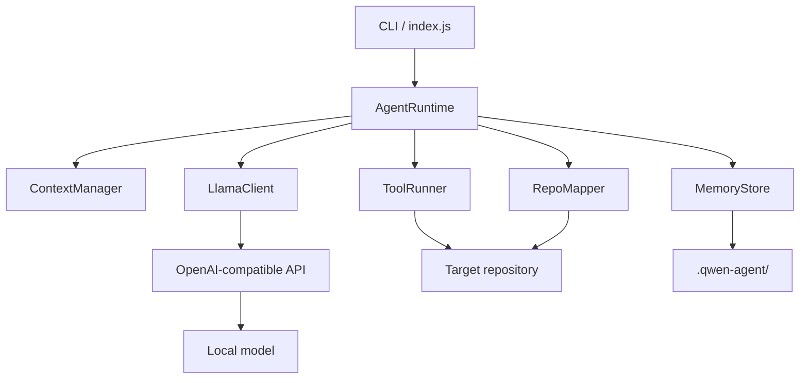
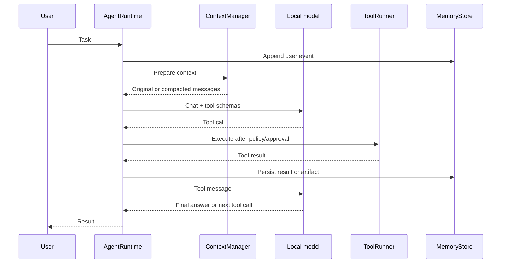

# Architecture

[繁體中文](ARCHITECTURE.zh-TW.md) · English

## Design thesis

ContextOS treats prompt context as a materialized working view, not as the database of an agent.

```text
Repository       = Source of truth
Persistent State = Durable task and project memory
Prompt Context   = Rebuildable working view
KV Cache         = Compute optimization
```

This separation allows the runtime to compact or reset a conversation without treating that event as task failure.

## Components



### CLI (`src/index.js`)

- Parses project, config, approval, and one-shot prompt arguments.
- Initializes the persistent store and runtime.
- Checks server health before accepting work.
- Owns user confirmations for mutating tools.
- Exposes slash commands for state, memory, maps, compaction, and reset.

### Agent runtime (`src/agent-runtime.js`)

- Rebuilds the system prompt from durable state.
- Coordinates model calls and tool-call loops.
- Refreshes context after memory or repository-map updates.
- Externalizes oversized tool output.
- Persists messages, tool activity, usage, and compaction reports.

### Context manager (`src/context-manager.js`)

- Estimates utilization from messages, tool schemas, tool choice, and fixed safety overhead.
- Compresses stale output, then prunes complete old tool exchanges while keeping protocol structure intact.
- Selects complete user-turn boundaries for compaction.
- Inserts schema-validated, derived Coding State Transfer into rebuilt context.
- Stops if the resulting prompt remains above the failure threshold.

### State-transfer validator (`src/state-transfer.js`)

- Requires every continuation-state field and its expected type.
- Rejects malformed JSON, missing fields, wrong types, and unexpected fields.
- Supports a single model retry before compaction fails without replacing history.

### Tool runner (`src/tools.js`)

- Implements file reads, globbing, grep, writes, edits, commands, repository maps, memory access, and episodes.
- Checks both lexical and real filesystem paths against the selected project root.
- Rejects file, directory-symlink, and Windows-junction escapes for reads, writes, and edits.
- Requests approval for writes, edits, and commands.
- Rejects a small set of known destructive command patterns.

### Memory store (`src/memory-store.js`)

- Atomic JSON writes for working state.
- Append-only JSONL session events.
- Markdown project memory.
- JSON episodes and repository map.
- Text artifacts plus JSON metadata.

### Repository mapper (`src/repo-mapper.js`)

- Scans common source files while excluding generated or large directories.
- Extracts a small symbol list using language-oriented regular expressions.
- Produces a compact repository summary for the system prompt.

### Local model client (`src/llama-client.js`)

- Uses the OpenAI-compatible health, model, and chat completion endpoints.
- Sends JSON Schema function tools.
- Uses request timeouts and structured error handling.
- Currently uses non-streaming responses.

## Turn lifecycle



## Failure boundaries

- The repository remains authoritative if summaries are wrong.
- Full artifacts remain on disk if prompt previews are truncated.
- Session JSONL remains available for investigation and future replay.
- The runtime fails closed above the 90% context threshold.
- Shell execution is outside the memory and path-containment guarantees; it is not sandboxed.

## Portability

The Node.js runtime uses built-in modules and relative paths. Windows management scripts are the tested control plane. The chat client is compatible with servers that implement the required OpenAI-style message and tool-call shapes; only llama.cpp + Qwen3.6 is currently validated end to end.
