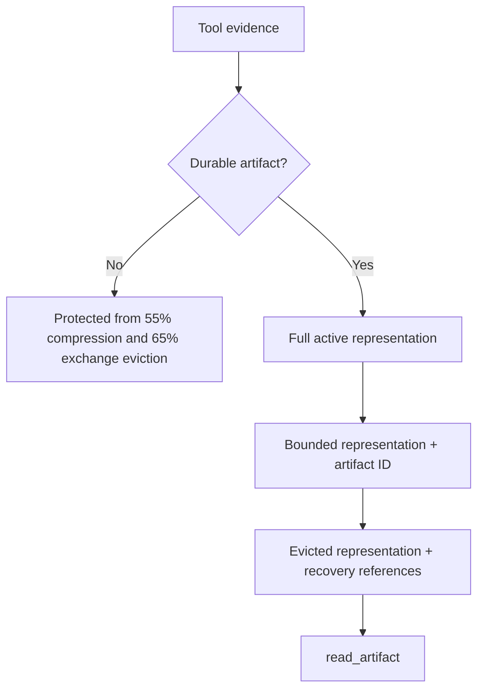
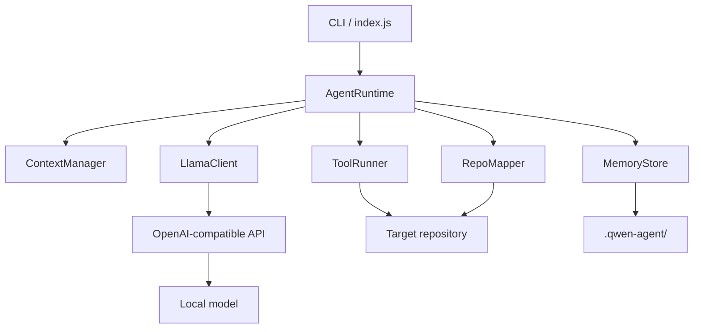
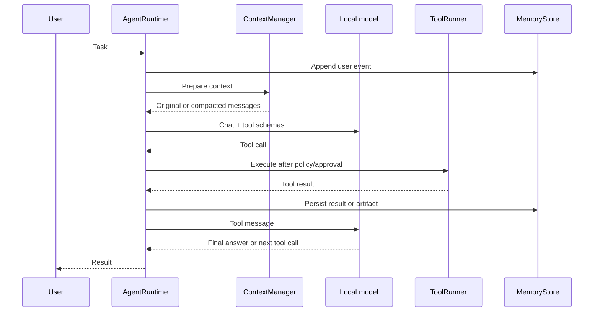

# Architecture

[繁體中文](ARCHITECTURE.zh-TW.md) · English

## Design thesis

ContextOS treats prompt context as a materialized working view, not as the database of an agent.

```text
Repository       = Mutable source of truth
Artifact         = Durable tool evidence
State Transfer   = Derived continuation state
Prompt Context   = Disposable working view
```

This separation allows the runtime to compact or reset a conversation without treating that event as task failure.

## Frozen core invariants

| ID | Invariant |
| --- | --- |
| I1 | The repository is the mutable source of truth. |
| I2 | Persistent state survives conversation reset. |
| I3 | State Transfer is derived state, never source of truth. |
| I4 | Deterministic tool-evidence eviction requires a durable recovery path. |
| I5 | Invalid compaction cannot replace valid history. |
| I6 | File and artifact tools cannot escape the selected project root. |
| I7 | Context pressure cannot silently exceed the safety envelope. |
| I8 | Corrupted auxiliary memory cannot hide unrelated valid memory. |

## Durability model



Persistence and rendering are independent. Results at or below `artifactPersistenceChars` may remain context-only. Larger results receive an exact artifact; results above `maxToolOutputChars` also receive a bounded prompt representation. A complete tool exchange is eligible for deterministic eviction only when all its results are recoverable.

## Components



### CLI (`src/index.js`)

- Parses project, config, approval, and one-shot prompt arguments.
- Initializes the persistent store and runtime.
- Checks server health before accepting work.
- Owns user confirmations for mutating tools.
- Exposes slash commands for state, memory, maps, compaction, and reset.

### Agent runtime (`src/agent-runtime.js`)

- Rebuilds the system prompt from durable state.
- Coordinates model calls and tool-call loops.
- Refreshes context after memory or repository-map updates.
- Externalizes oversized tool output.
- Persists messages, tool activity, usage, and compaction reports.
- Maintains cumulative artifact durability metrics.

### Tool evidence manager (`src/tool-evidence.js`)

- Prepares a canonical full tool-result representation.
- Persists medium and large evidence independently of prompt size.
- Renders full or bounded model-visible representations.
- Adds machine-checkable `context_os` recovery metadata to internal messages.

### Model serialization boundary (`src/context-messages.js`)

- Converts internal context units into OpenAI-compatible messages.
- Removes `context_os` and future runtime-only policy metadata.
- Preserves only protocol fields required by the local model server.

### Context Unit and Inventory (`src/context-unit.js`, `src/context-inventory.js`)

The v0.2 development line adds an observational semantic inventory. Context Units have stable session-scoped IDs, explicit authority and recoverability, Runtime-owned protected reasons, typed dependencies, token cost, and lifecycle. The inventory attaches identity only through internal `context_os` metadata, emits bounded summaries by default, and is inspectable with `/inventory`.

M1 does not authorize context actions and does not alter the frozen pressure policy. It is the structured input boundary for the Planner and Validator described in [RFC-001](rfcs/RFC-001-ADAPTIVE-CONTEXT-PLANNING.md).

### CompactionPlan protocol and FakePlanner (`src/compaction-plan.js`, `src/planners/`)

M2 gives untrusted Planner output a strict proposal language. Plans bind to a canonical inventory ID and SHA-256 fingerprint, reference only stable Context Unit IDs, and may propose `KEEP`, `COMPRESS`, `EXTERNALIZE`, `EVICT`, or audit-only `PROMOTE_PROPOSAL`. Unknown fields, stale snapshots, duplicate/unknown units, replacement content, and Planner claims over Runtime-owned state fail closed.

Unmentioned units mean `KEEP`. `FakePlanner` provides a model-free asynchronous test double. M2 itself stops after parsing and snapshot binding; its proposal type never grants permission. See the [CompactionPlan protocol](COMPACTION_PLAN_PROTOCOL.md).

### Runtime Validator (`src/compaction-validator.js`)

M3 converts a bound proposal into a distinct `ValidatedPlan`. Frozen Runtime-owned policy evaluates protection, authority, explicit recoverability predicates, and transitive `depends_on` availability in that order. Missing dependency targets and cycles reject the whole plan. `PROMOTE_PROPOSAL` is audit-only.

The Validator calculates only a gross potential-reduction upper bound and keeps `actualReductionTokens` null. It is a pure, model-free authorization boundary and stops before context mutation, transformation, artifact creation, memory writes, Qwen calls, or deterministic policy changes. See [Compaction authorization](COMPACTION_VALIDATION.md).

### Bounded semantic Planner (`src/planners/`, `src/semantic-proposal.js`)

M4 builds a Planner-specific view from an internal inventory snapshot. Per-unit deterministic representations, visible-unit count, task text, model output, and the complete Planner request all have hard bounds. When not every unit fits, protected, USER, active, dependency-root, and unresolved units receive deterministic priority; excluded units remain implicit `KEEP`.

`QwenPlanner` uses a stateless OpenAI-compatible chat call with no tools, the versioned `planner-v1` system prompt, low temperature, strict JSON, and at most one correction attempt. Plan ID, inventory identity, and visible-unit membership are verified before the unchanged M3 Validator runs. Session audit records experimental attempts/results separately from semantic memory. Validator rejection stops and selects fallback; it never triggers autonomous replanning. See [Bounded semantic planning](BOUNDED_SEMANTIC_PLANNING.md).

### Context manager (`src/context-manager.js`)

- Estimates utilization from messages, tool schemas, tool choice, and fixed safety overhead.
- Compresses stale output, then prunes complete old tool exchanges while keeping protocol structure intact.
- Selects complete user-turn boundaries for compaction.
- Inserts schema-validated, derived Coding State Transfer into rebuilt context.
- Gates 55% compression and 65% exchange eviction on artifact recoverability.
- Reports created artifacts, persisted characters, compression, eviction, and blocked-eviction counts.
- Stops if the resulting prompt remains above the failure threshold.

### State-transfer validator (`src/state-transfer.js`)

- Requires every continuation-state field and its expected type.
- Rejects malformed JSON, missing fields, wrong types, and unexpected fields.
- Supports a single model retry before compaction fails without replacing history.

### Tool runner (`src/tools.js`)

- Implements file reads, globbing, grep, writes, edits, commands, repository maps, memory access, and episodes.
- Checks both lexical and real filesystem paths against the selected project root.
- Rejects file, directory-symlink, and Windows-junction escapes for reads, writes, and edits.
- Requests approval for writes, edits, and commands.
- Rejects a small set of known destructive command patterns.

### Memory store (`src/memory-store.js`)

- Atomic JSON writes for working state.
- Append-only JSONL session events.
- Markdown project memory.
- JSON episodes and repository map.
- Text artifacts plus JSON metadata.
- Bounded artifact reads by ID with SHA-256 integrity verification.
- Latest-N-valid retrieval for episodes and artifact metadata.

### Repository mapper (`src/repo-mapper.js`)

- Scans common source files while excluding generated or large directories.
- Extracts a small symbol list using language-oriented regular expressions.
- Produces a compact repository summary for the system prompt.

### Local model client (`src/llama-client.js`)

- Uses the OpenAI-compatible health, model, and chat completion endpoints.
- Sends JSON Schema function tools.
- Uses request timeouts and structured error handling.
- Currently uses non-streaming responses.

## Turn lifecycle



## Failure boundaries

- The repository remains authoritative if summaries are wrong.
- Full artifacts remain on disk if prompt previews are truncated.
- Session JSONL remains available for investigation and future replay.
- The runtime fails closed above the 90% context threshold.
- Non-durable tool evidence is kept when deterministic GC or exchange eviction cannot prove recovery.
- Shell execution is outside the memory and path-containment guarantees; it is not sandboxed.

## Phase 1/2 freeze

v0.1.2 freezes the deterministic baseline. The 0.1.x line may still receive critical bug, security, regression, and documentation fixes, but no new memory architecture, compaction policy, repository intelligence, retrieval engine, or agent topology. Adaptive or semantic planning begins in v0.2.0 and must remain subordinate to these runtime invariants.

## Portability

The Node.js runtime uses built-in modules and relative paths. Windows management scripts are the tested control plane. The chat client is compatible with servers that implement the required OpenAI-style message and tool-call shapes; only llama.cpp + Qwen3.6 is currently validated end to end.
