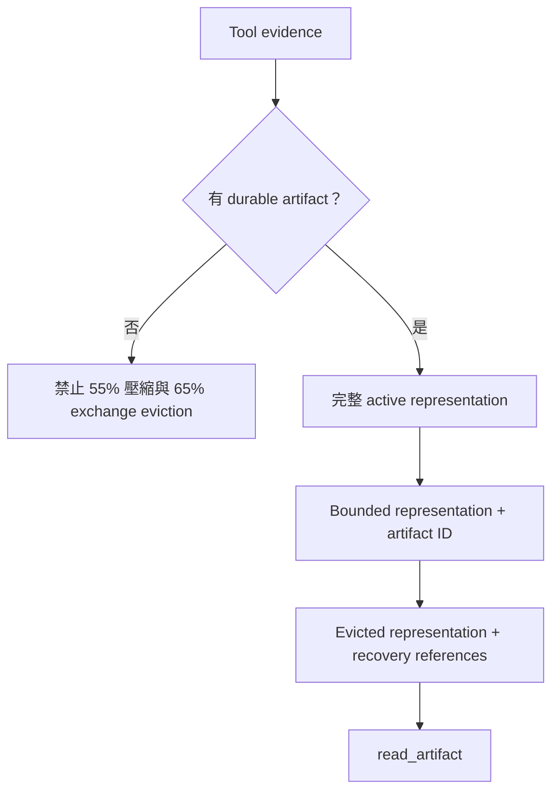
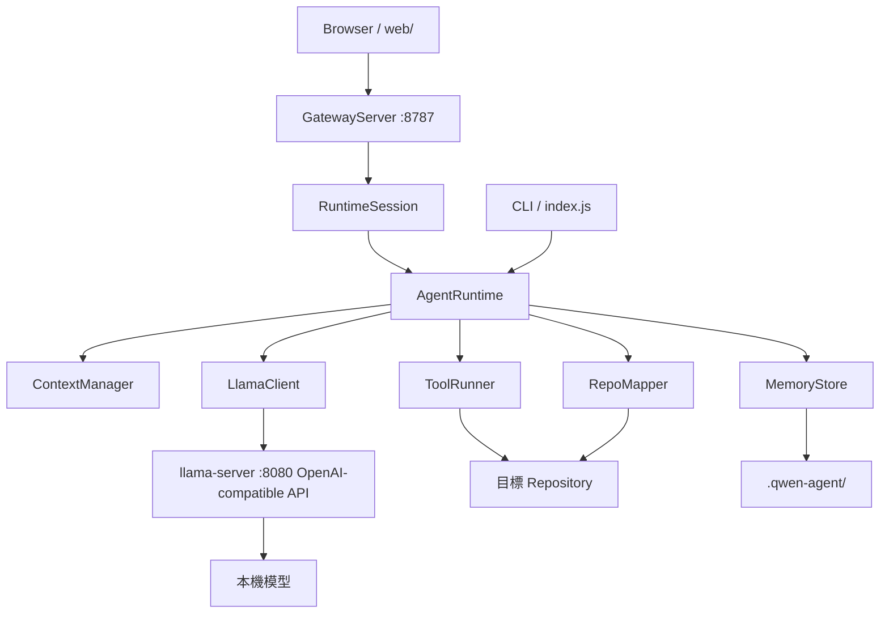
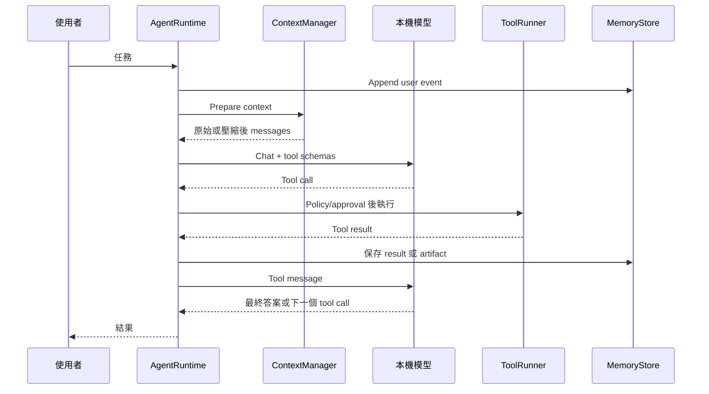

# 系統架構

繁體中文 · [English](ARCHITECTURE.md)

## 設計主張

ContextOS 把 prompt context 視為具體化工作視圖，而不是 Agent 的資料庫。

```text
Repository       = 可變動的 source of truth
Artifact         = 持久 tool evidence
State Transfer   = 衍生 continuation state
Prompt Context   = 可拋棄的工作視圖
```

這個分離讓 Runtime 可以壓縮或重設 conversation，而不把它視為任務失敗。

## 凍結的核心 invariants

| ID | Invariant |
| --- | --- |
| I1 | Repository 是可變動的 source of truth。 |
| I2 | Persistent state 必須跨 conversation reset 保存。 |
| I3 | State Transfer 是衍生狀態，不能成為 source of truth。 |
| I4 | Deterministic tool-evidence eviction 必須存在 durable recovery path。 |
| I5 | Invalid compaction 不能取代 valid history。 |
| I6 | File 與 artifact tools 不能離開 selected project root。 |
| I7 | Context pressure 不能靜默超過 safety envelope。 |
| I8 | Corrupted auxiliary memory 不能遮蔽無關的 valid memory。 |
| I9 | Browser presentation state 不能取代或重新提交 Runtime-owned conversation state。 |

## Durability Model



Persistence 與 rendering 彼此獨立。小於等於 `artifactPersistenceChars` 的結果可保持 context-only；較大結果會建立 exact artifact；超過 `maxToolOutputChars` 時另產生 bounded prompt representation。只有所有 result 都可恢復時，完整 tool exchange 才可執行 deterministic eviction。

## 元件



### Runtime Chat Gateway（`src/gateway-server.js`、`src/runtime-session.js`）

- 只在 loopback 提供無 dependency 的 Browser UI。
- 每個 RuntimeSession 建立一個 AgentRuntime 與一份 conversation state。
- 共用 LlamaClient／llama-server，同時隔離 session message、inventory、memory binding、events 與 approvals。
- 將 Runtime events 轉為有界、可 replay 的 SSE，不改變 AgentRuntime semantics。
- Mutation confirmation 使用 single-use Browser approval ID；逾時或 session close 時 fail closed。
- 拒絕 cross-site request 與不可信 Host；Browser 絕不提交 conversation history。

### CLI（`src/index.js`）

- 解析 project、config、approval 與單次 prompt 參數。
- 初始化持久 store 與 Runtime。
- 接受任務前檢查 server health。
- 負責有副作用工具的人工確認。
- 提供 state、memory、map、compaction 與 reset 指令。

### Agent Runtime（`src/agent-runtime.js`）

- 從持久狀態重建 system prompt。
- 協調模型與 tool-call loop。
- Memory 或 repo map 更新後刷新 context。
- 將過大的工具輸出外部化。
- 保存 messages、tool activity、usage 與 compaction report。
- 維護累計 artifact durability metrics。

### Tool Evidence Manager（`src/tool-evidence.js`）

- 準備 canonical full tool-result representation。
- 不受 prompt size 影響，獨立持久化中型與大型 evidence。
- 依大小產生完整或 bounded model-visible representation。
- 在 internal message 加入可 machine-check 的 `context_os` recovery metadata。

### Model serialization boundary（`src/context-messages.js`）

- 將 internal context unit 轉為 OpenAI-compatible message。
- 移除 `context_os` 與未來 runtime-only policy metadata。
- 只保留本機 model server 需要的 protocol fields。

### Context Unit 與 Inventory（`src/context-unit.js`、`src/context-inventory.js`）

v0.2 開發線加入 observational semantic inventory。Context Unit 使用 session-scoped stable ID，明確區分 authority 與 recoverability，記錄 Runtime-owned protected reasons、typed dependencies、token cost 與 lifecycle。Inventory 只透過內部 `context_os` metadata 附加 identity，預設輸出 bounded summary，並可用 `/inventory` 檢查。

M1 不授權任何 context action，也不修改 frozen pressure policy。它是 Planner 與 Validator 的結構化輸入邊界，詳見 [RFC-001](rfcs/RFC-001-ADAPTIVE-CONTEXT-PLANNING.zh-TW.md)。

### CompactionPlan protocol 與 FakePlanner（`src/compaction-plan.js`、`src/planners/`）

M2 為不可信 Planner output 定義 strict proposal language。Plan 綁定 canonical inventory ID 與 SHA-256 fingerprint，只能引用 stable Context Unit ID，並可提出 `KEEP`、`COMPRESS`、`EXTERNALIZE`、`EVICT` 或 audit-only `PROMOTE_PROPOSAL`。Unknown field、stale snapshot、duplicate/unknown unit、replacement content 與 Planner 對 Runtime-owned state 的 claim 都會 fail closed。

Planner 未提到的 unit 一律 `KEEP`。`FakePlanner` 是不使用模型的 asynchronous test double。M2 本身在 parsing 與 snapshot binding 後停止；其 proposal type 永遠不會授予 permission。詳見 [CompactionPlan protocol](COMPACTION_PLAN_PROTOCOL.zh-TW.md)。

### Runtime Validator（`src/compaction-validator.js`）

M3 將 bound proposal 轉成獨立 `ValidatedPlan`。Frozen Runtime-owned policy 依序評估 protection、authority、明確 recoverability predicates 與 transitive `depends_on` availability。Missing dependency target 與 cycle 會拒絕 whole plan；`PROMOTE_PROPOSAL` 只供 audit。

Validator 只計算 gross potential-reduction upper bound，`actualReductionTokens` 維持 null。它是 pure、model-free authorization boundary，並在 context mutation、transformation、artifact creation、memory write、Qwen call 或 deterministic policy change 前停止。詳見 [Compaction authorization](COMPACTION_VALIDATION.zh-TW.md)。

### Bounded semantic Planner（`src/planners/`、`src/semantic-proposal.js`）

M4 由 internal inventory snapshot 建立 Planner-specific view。Per-unit deterministic representation、visible-unit count、task text、model output 與完整 Planner request 都有 hard bound。無法容納全部 unit 時，protected、USER、active、dependency-root 與 unresolved unit 取得 deterministic priority；被排除的 unit 保持 implicit `KEEP`。

`QwenPlanner` 使用 stateless OpenAI-compatible chat call，不提供 tools，套用 versioned `planner-v1` system prompt、low temperature、strict JSON 與最多一次 correction。Plan ID、inventory identity 與 visible-unit membership 驗證後，才呼叫未修改的 M3 Validator。Session audit 將 experimental attempts／results 與 semantic memory 分離。Validator rejection 直接停止並選擇 fallback，不會觸發 autonomous replanning。詳見 [Bounded semantic planning](BOUNDED_SEMANTIC_PLANNING.zh-TW.md)。

### Execution preflight（`src/recovery-verifier.js`、`src/execution-preflight.js`）

Dev.5 D0-D2 在 `ValidatedPlan` 與 execution 之間新增 read-only boundary。Strict preflight 只接受 current、potentially sufficient、non-fallback 且完整覆蓋 inventory 的 Runtime plan；`RecoveryVerifier` 再依 current state 重新驗證 applicable artifact、repository、memory 或 rebuildable source。缺 reference／provider、integrity drift、path escape、stale inventory、rejected decision 或 insufficient plan，都會使完整 preflight 失敗。

只有成功的 preflight 才回傳 distinct、deep-frozen `ExecutablePlan`。它包含 decisions 與 recovery proofs，但沒有 replacement content、mutation callback、write authority 或 actual-reduction claim。`config/m4-freeze.json` 固定 immutable M4 experiment inputs。詳見 [Validated Transformation and Execution Contract](EXECUTION_CONTRACT.zh-TW.md)。

### Transformation candidates（`src/transformation-candidate.js`、`src/context-transformer.js`、`src/qwen-transformer.js`）

D3 再次檢查 exact inventory identity，以 Runtime 計算的 source-content SHA-256 綁定每個 decision，並為每個 executable decision 產生一個 immutable candidate。KEEP 與 PROMOTE_PROPOSAL 維持 NOOP／AUDIT_ONLY；EVICT 成為描述性的 REMOVE；EXTERNALIZE 使用 canonical Runtime recovery marker。只有 COMPRESS 呼叫 isolated、無 tools 的 `transformer-v1`，其 strict output 只有 candidate content，不含 metadata。

Model output 回來後，Runtime 才計算 candidate SHA-256 與 token estimate。Candidate 超出 target 會保留給 D4，不由 D3 retry 或 reject。Stale inventory 或任一 candidate generation failure 都會拒絕整份 preparation；messages、inventory、lifecycle、artifacts 與 memory 完全不 mutation。

### Post-transform validation（`src/post-transform-validator.js`、`src/validated-transformation.js`、`src/qwen-transform-validator.js`）

D4 將 candidate 綁回 exact `ExecutablePlan` 與 current inventory，要求每個 unit exactly once，並以目前 Runtime data 重新計算 source／candidate digest 與 candidate token estimate。Deterministic per-operation rules 會拒絕不合規的 NOOP、AUDIT_ONLY、REMOVE 與 EXTERNALIZE candidate；canonical recovery marker 比對 exact content，不只比 digest。COMPRESS candidate 必須非空、確實降低 estimated tokens，且不得超過 requested target。

只有通過 mechanical checks 的 COMPRESS candidate 會進入 isolated、無 tools 的 `transform-validator-v1`。它只能針對 facts、constraints、decisions、identifiers、errors、unresolved state 與 meaning 是否保存回傳 ACCEPT／REJECT assessment，不能修改 content，也不能推翻 Runtime failure。任一 failure 都拒絕整份 transformation。成功只產生 deep-frozen `ValidatedTransformation`，不含 replacement content，並保持 `zeroMutation: true`、`actualReductionTokens: null`；D5 在任何 commit 前必須再將它綁回原始 candidate。

### Atomic execution（`src/atomic-executor.js`、`src/execution-result.js`）

D5 完全 model-free，並將 `ValidatedTransformation` 視為 approval metadata，而非 self-contained capability。`AtomicExecutor` 要求原始 candidate 與 executable plan、exact current inventory identity 與 unit coverage、Runtime-owned messages、writable context generation，以及 `RecoveryVerifier`；commit 前會重查每個 source／candidate SHA-256，並重新驗證 destructive action 的 current recovery source。

所有 NOOP、AUDIT_ONLY、REMOVE 與 exact REPLACE operation 都先套用到完整 cloned message context。Runtime 驗證 tool-call structure、偵測 asynchronous recovery checks 期間的 generation／reference drift，最後只做一次 synchronous message-array reference swap，並在同一 critical section consume validation ID。任何 stale binding、recovery source 消失、build failure、validation 重複使用或 commit failure，都回傳 immutable `EXECUTION_ABORTED`，不留下 partial executor mutation。D5 也為 D6 保存 canonical pre-commit token breakdown 與 exact tool-envelope digest，但不宣稱 actual reduction。

### Post-commit finalization（`src/execution-finalizer.js`、`src/execution-report.js`）

D6 只接受 immutable committed `ExecutionResult`，並要求 current context generation 與仍為 pre-commit 狀態的 inventory registry 完全匹配。它在原有 registry 重跑 `ContextInventory.synchronize()`，使 removed unit 轉為 inactive，replacement 保留 stable ID 並取得 current content／token cost；新 identity 必須反映 committed messages。

Before／after 都使用 `ContextManager.estimateComponents()`，並綁定 exact same tool-schema digest 與 fixed overhead。Actual reduction 是 signed `before.totalTokens - after.totalTokens`，絕不 clamp 到零，且與 M3 gross potential upper bound 分開。成功回傳 immutable `ExecutionReport`；drift、rebuild 或 accounting failure 回傳 `EXECUTION_FINALIZATION_FAILED`、維持 `actualReductionTokens: null`，且不 rollback 或重新標記 D5 commit。

### Context Manager（`src/context-manager.js`）

- 由 messages、tool schemas、tool choice 與固定安全餘量估算 prompt 使用率。
- 先壓縮過期 output，再移除完整舊 tool exchanges，同時維持 protocol 結構。
- 以完整 user-turn 邊界執行壓縮。
- 在重建 context 中插入經 schema 驗證的衍生 Coding State Transfer。
- 55% 壓縮與 65% exchange eviction 都必須通過 artifact recoverability gate。
- 回報 artifacts、持久 chars、compression、eviction 與 blocked eviction 計數。
- 壓縮後仍超過 failure threshold 時停止。

### State-transfer validator（`src/state-transfer.js`）

- 要求所有 continuation-state 欄位與預期型別。
- 拒絕 malformed JSON、缺少欄位、錯誤型別與多餘欄位。
- Model 可重試一次；仍失敗時不取代 history，直接停止 compaction。

### Tool Runner（`src/tools.js`）

- 實作讀檔、glob、grep、寫檔、編輯、命令、repo map、memory 與 episode。
- 所有 file path 都以 lexical 與 real filesystem path 對 selected project root 檢查。
- Read、write、edit 會拒絕 file/directory symlink 與 Windows junction escape。
- 寫檔、編輯與命令需要確認。
- 拒絕少量已知的破壞性命令 pattern。

### Memory Store（`src/memory-store.js`）

- Working state 使用 atomic JSON write。
- Session 使用 append-only JSONL events。
- Project memory 使用 Markdown。
- Episodes 與 repo map 使用 JSON。
- Artifacts 使用 text 加 JSON metadata。
- 依 ID bounded read artifact，並驗證 SHA-256 integrity。
- Episodes 與 artifact metadata 採 latest-N-valid retrieval。

### Repository Mapper（`src/repo-mapper.js`）

- 掃描常見 source files，排除 generated 或大型目錄。
- 使用依語言調整的 regex 擷取少量 symbol。
- 產生可注入 system prompt 的 compact summary。

### 本機模型 Client（`src/llama-client.js`）

- 使用 OpenAI-compatible health、model 與 chat completion endpoints。
- 傳送 JSON Schema function tools。
- 支援 request timeout 與 structured error handling。
- 目前採非 streaming response。

## 單回合生命週期



## Failure boundaries

- Summary 出錯時，repository 仍是權威來源。
- Prompt preview 被縮短時，完整 artifact 仍在磁碟。
- Session JSONL 可供調查與未來 replay。
- Runtime 在 90% context threshold 以上 fail closed。
- 無法證明 recovery 時，non-durable tool evidence 會保留，不執行 deterministic GC／exchange eviction。
- Shell execution 不受 memory 與 path containment 完整保護；它沒有 sandbox。

## Phase 1/2 Freeze

v0.1.2 凍結 deterministic baseline。0.1.x 仍可接受 critical bug、security、regression 與 documentation fix，但不再加入新的 memory architecture、compaction policy、repository intelligence、retrieval engine 或 agent topology。Adaptive／semantic planning 從 v0.2.0 開始，而且必須受這些 runtime invariants 約束。

## 可攜性

Node.js Runtime 只使用內建模組與相對路徑。Windows 管理腳本是目前驗證過的 control plane。Chat client 可連接實作必要 OpenAI-style message/tool-call shape 的 server；目前只有 llama.cpp + Qwen3.6 完成端到端驗證。
