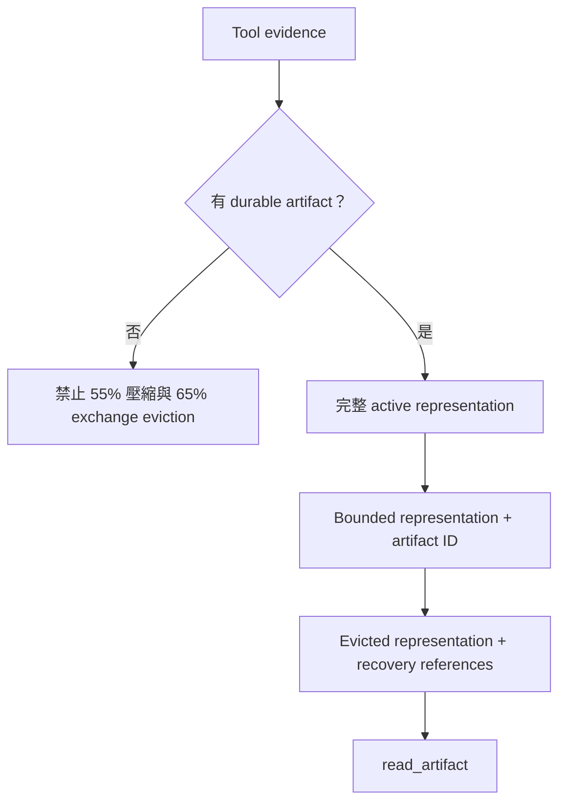
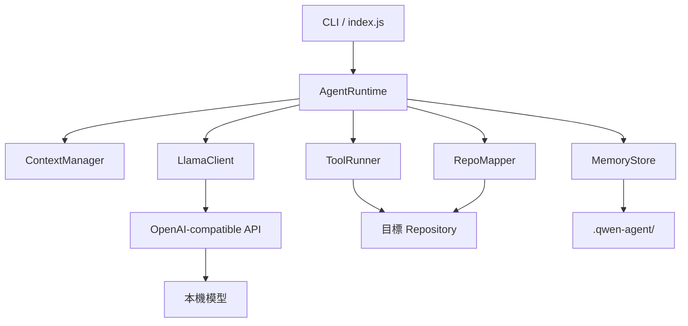
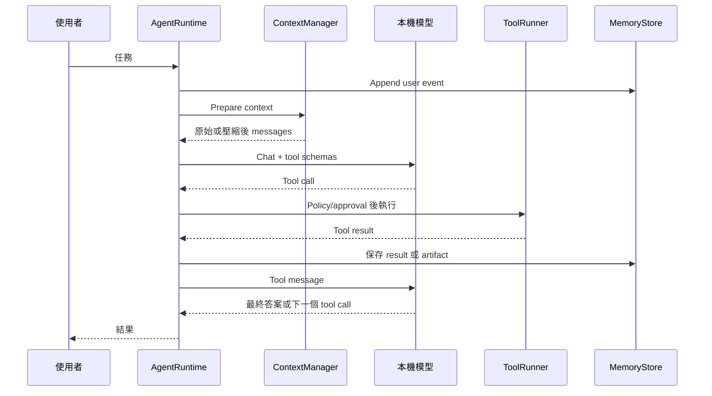

# 系統架構

繁體中文 · [English](ARCHITECTURE.md)

## 設計主張

ContextOS 把 prompt context 視為具體化工作視圖，而不是 Agent 的資料庫。

```text
Repository       = 可變動的 source of truth
Artifact         = 持久 tool evidence
State Transfer   = 衍生 continuation state
Prompt Context   = 可拋棄的工作視圖
```

這個分離讓 Runtime 可以壓縮或重設 conversation，而不把它視為任務失敗。

## 凍結的核心 invariants

| ID | Invariant |
| --- | --- |
| I1 | Repository 是可變動的 source of truth。 |
| I2 | Persistent state 必須跨 conversation reset 保存。 |
| I3 | State Transfer 是衍生狀態，不能成為 source of truth。 |
| I4 | Deterministic tool-evidence eviction 必須存在 durable recovery path。 |
| I5 | Invalid compaction 不能取代 valid history。 |
| I6 | File 與 artifact tools 不能離開 selected project root。 |
| I7 | Context pressure 不能靜默超過 safety envelope。 |
| I8 | Corrupted auxiliary memory 不能遮蔽無關的 valid memory。 |

## Durability Model



Persistence 與 rendering 彼此獨立。小於等於 `artifactPersistenceChars` 的結果可保持 context-only；較大結果會建立 exact artifact；超過 `maxToolOutputChars` 時另產生 bounded prompt representation。只有所有 result 都可恢復時，完整 tool exchange 才可執行 deterministic eviction。

## 元件



### CLI（`src/index.js`）

- 解析 project、config、approval 與單次 prompt 參數。
- 初始化持久 store 與 Runtime。
- 接受任務前檢查 server health。
- 負責有副作用工具的人工確認。
- 提供 state、memory、map、compaction 與 reset 指令。

### Agent Runtime（`src/agent-runtime.js`）

- 從持久狀態重建 system prompt。
- 協調模型與 tool-call loop。
- Memory 或 repo map 更新後刷新 context。
- 將過大的工具輸出外部化。
- 保存 messages、tool activity、usage 與 compaction report。
- 維護累計 artifact durability metrics。

### Tool Evidence Manager（`src/tool-evidence.js`）

- 準備 canonical full tool-result representation。
- 不受 prompt size 影響，獨立持久化中型與大型 evidence。
- 依大小產生完整或 bounded model-visible representation。
- 在 internal message 加入可 machine-check 的 `context_os` recovery metadata。

### Model serialization boundary（`src/context-messages.js`）

- 將 internal context unit 轉為 OpenAI-compatible message。
- 移除 `context_os` 與未來 runtime-only policy metadata。
- 只保留本機 model server 需要的 protocol fields。

### Context Unit 與 Inventory（`src/context-unit.js`、`src/context-inventory.js`）

v0.2 開發線加入 observational semantic inventory。Context Unit 使用 session-scoped stable ID，明確區分 authority 與 recoverability，記錄 Runtime-owned protected reasons、typed dependencies、token cost 與 lifecycle。Inventory 只透過內部 `context_os` metadata 附加 identity，預設輸出 bounded summary，並可用 `/inventory` 檢查。

M1 不授權任何 context action，也不修改 frozen pressure policy。它是未來 Planner 與 Validator 的結構化輸入邊界，詳見 [RFC-001](rfcs/RFC-001-ADAPTIVE-CONTEXT-PLANNING.zh-TW.md)。

### Context Manager（`src/context-manager.js`）

- 由 messages、tool schemas、tool choice 與固定安全餘量估算 prompt 使用率。
- 先壓縮過期 output，再移除完整舊 tool exchanges，同時維持 protocol 結構。
- 以完整 user-turn 邊界執行壓縮。
- 在重建 context 中插入經 schema 驗證的衍生 Coding State Transfer。
- 55% 壓縮與 65% exchange eviction 都必須通過 artifact recoverability gate。
- 回報 artifacts、持久 chars、compression、eviction 與 blocked eviction 計數。
- 壓縮後仍超過 failure threshold 時停止。

### State-transfer validator（`src/state-transfer.js`）

- 要求所有 continuation-state 欄位與預期型別。
- 拒絕 malformed JSON、缺少欄位、錯誤型別與多餘欄位。
- Model 可重試一次；仍失敗時不取代 history，直接停止 compaction。

### Tool Runner（`src/tools.js`）

- 實作讀檔、glob、grep、寫檔、編輯、命令、repo map、memory 與 episode。
- 所有 file path 都以 lexical 與 real filesystem path 對 selected project root 檢查。
- Read、write、edit 會拒絕 file/directory symlink 與 Windows junction escape。
- 寫檔、編輯與命令需要確認。
- 拒絕少量已知的破壞性命令 pattern。

### Memory Store（`src/memory-store.js`）

- Working state 使用 atomic JSON write。
- Session 使用 append-only JSONL events。
- Project memory 使用 Markdown。
- Episodes 與 repo map 使用 JSON。
- Artifacts 使用 text 加 JSON metadata。
- 依 ID bounded read artifact，並驗證 SHA-256 integrity。
- Episodes 與 artifact metadata 採 latest-N-valid retrieval。

### Repository Mapper（`src/repo-mapper.js`）

- 掃描常見 source files，排除 generated 或大型目錄。
- 使用依語言調整的 regex 擷取少量 symbol。
- 產生可注入 system prompt 的 compact summary。

### 本機模型 Client（`src/llama-client.js`）

- 使用 OpenAI-compatible health、model 與 chat completion endpoints。
- 傳送 JSON Schema function tools。
- 支援 request timeout 與 structured error handling。
- 目前採非 streaming response。

## 單回合生命週期



## Failure boundaries

- Summary 出錯時，repository 仍是權威來源。
- Prompt preview 被縮短時，完整 artifact 仍在磁碟。
- Session JSONL 可供調查與未來 replay。
- Runtime 在 90% context threshold 以上 fail closed。
- 無法證明 recovery 時，non-durable tool evidence 會保留，不執行 deterministic GC／exchange eviction。
- Shell execution 不受 memory 與 path containment 完整保護；它沒有 sandbox。

## Phase 1/2 Freeze

v0.1.2 凍結 deterministic baseline。0.1.x 仍可接受 critical bug、security、regression 與 documentation fix，但不再加入新的 memory architecture、compaction policy、repository intelligence、retrieval engine 或 agent topology。Adaptive／semantic planning 從 v0.2.0 開始，而且必須受這些 runtime invariants 約束。

## 可攜性

Node.js Runtime 只使用內建模組與相對路徑。Windows 管理腳本是目前驗證過的 control plane。Chat client 可連接實作必要 OpenAI-style message/tool-call shape 的 server；目前只有 llama.cpp + Qwen3.6 完成端到端驗證。
