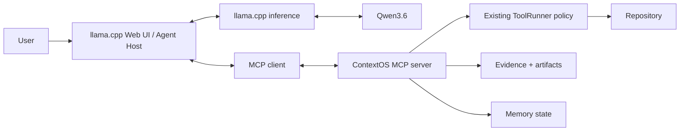

# ContextOS MCP Capability Server

[繁體中文](MCP_SERVER.zh-TW.md) · English

Version: 0.2.0-dev.7

## Purpose

ContextOS is a standards-based local MCP capability server. It does not proxy inference, own the chat transcript, render a Web UI, or replace the host's reasoning and streaming path.

```text
Qwen3.6     = cognitive model
llama.cpp   = inference runtime + primary Web UI / agent host
ContextOS   = trusted MCP capabilities + context policy engine
Repository  = mutable source of truth
```



The host owns conversation history. ContextOS owns one selected project root, one `MemoryStore`, and one tool/evidence authority boundary.

## Compatibility decision

The first transport is standard MCP stdio. llama.cpp `b10295` accepts a Cursor-compatible `mcpServers` JSON file containing `command`, `args`, `env`, `cwd`, and `timeout_ms`, starts each server as a child process, and negotiates MCP `2024-11-05`. ContextOS uses the official TypeScript MCP SDK 1.30.0 and has a protocol smoke test for that exact client version.

Primary references:

- [llama.cpp b10295 server options](https://github.com/ggml-org/llama.cpp/blob/b10295/tools/server/README.md)
- [llama.cpp b10295 MCP transport](https://github.com/ggml-org/llama.cpp/blob/b10295/tools/server/server-mcp.cpp)
- [Official MCP TypeScript SDK](https://github.com/modelcontextprotocol/typescript-sdk)

llama.cpp `b10295` consumes MCP tools through its `/tools` integration. ContextOS also implements MCP resources for hosts that support them; the llama.cpp integration does not depend on resource support.

## Runtime boundary

The MCP adapter is deliberately thin:

```text
MCP request
  -> official MCP SDK validation
  -> existing ToolRunner
  -> existing containment / policy
  -> existing ToolEvidenceManager
  -> machine-readable MCP result
```

`src/mcp-tools.js` does not call `fs.readFile` or execute processes directly. Repository operations still pass through `src/tools.js`; artifact persistence and recovery still pass through `ToolEvidenceManager` and `MemoryStore`.

## Tool surface

The default `read-only` mode advertises six existing tools:

| Tool | Capability |
| --- | --- |
| `read_file` | Read bounded lines inside the selected project |
| `file_glob_search` | Match repository paths |
| `grep_search` | Search bounded repository text |
| `read_working_state` | Read state, project memory, episodes, and artifact metadata |
| `read_artifact` | Recover bounded durable evidence with integrity validation |
| `get_datetime` | Read local and UTC time |

Explicit `trusted-local` mode additionally advertises:

| Tool | Capability |
| --- | --- |
| `write_file` | Create or overwrite a project file |
| `edit_file` | Apply exact text replacement |
| `run_command` | Run a guarded command when `security.allowCommands` is also true |
| `build_repo_map` | Rebuild the derived repository map |
| `update_working_state` | Persist derived continuation state |
| `save_episode` | Persist reusable episodic memory |

These names and schemas come from the existing `TOOL_DEFINITIONS`; this milestone does not invent parallel aliases or a second filesystem implementation.

## Resource surface

Resources are read-only, bounded, Runtime-derived, and machine-readable:

| URI | Content |
| --- | --- |
| `contextos://repository/map` | Current persisted repository map |
| `contextos://memory/project` | Human-editable project memory |
| `contextos://state/working` | Derived continuation state |
| `contextos://artifacts` | Bounded artifact metadata index |
| `contextos://artifacts/{artifactId}` | Integrity-checked artifact content |

Private transcript/session files are not resources. The default resource response ceiling is 128 KiB; oversized values remain valid JSON and report `truncated`, `originalBytes`, and a bounded preview.

## Evidence contract

Every executed MCP tool result goes through `ToolEvidenceManager`. Results that meet the existing persistence threshold receive a durable artifact. Results that exceed the rendering limit are replaced by a recovery preview rather than being copied in full into the model context.

```json
{
  "schemaVersion": 1,
  "ok": true,
  "tool": "read_file",
  "result": {},
  "error": null,
  "evidence": {
    "durable": true,
    "artifactId": "read_file-...",
    "sha256": "...",
    "recoveryType": "artifact",
    "originalChars": 2345,
    "resultStatus": "ok"
  }
}
```

The repository or artifact remains the source of truth. The MCP response is a transport representation and never grants itself authority.

## Mutation safety

`read-only` is the default. Mutation tools are not advertised, and an attempted unknown mutation fails closed at the MCP layer.

Here, read-only means repository source/state mutation capabilities are absent. ContextOS still initializes `.qwen-agent/` and may persist durable evidence generated by read operations; that internal recovery write is part of the existing evidence contract.

`trusted-local` must be selected explicitly in `config/mcp.json` or with `--mode trusted-local`. It enables non-interactive auto-approval because stdio has no interactive approval channel. This does not bypass:

- selected-project real-path containment;
- symbolic-link and Windows-junction escape checks;
- destructive-command denial;
- `security.allowCommands`;
- command timeouts;
- evidence generation.

Keep `security.allowCommands` false unless command execution is specifically required. Do not expose llama.cpp agent/MCP features to a LAN or untrusted browser origin.

## Configuration

`config/mcp.json` is separate from llama.cpp model/inference configuration:

```json
{
  "schemaVersion": 1,
  "projectRoot": "../workspace",
  "mode": "read-only",
  "maximumResourceBytes": 131072,
  "artifactPolicy": {
    "artifactPersistenceChars": 800,
    "maxToolOutputChars": 12000,
    "staleToolCompressionChars": 800,
    "staleToolPreviewChars": 500
  },
  "security": {
    "allowCommands": false,
    "commandTimeoutSeconds": 120
  }
}
```

`00_setup.bat` installs the locked dependencies, creates this local file, and generates `config/llama-mcp.json` with absolute Node and ContextOS paths. The generated host configuration has this shape:

```json
{
  "mcpServers": {
    "context-os": {
      "command": "C:\\Program Files\\nodejs\\node.exe",
      "args": [
        "C:\\path\\to\\context-os\\src\\mcp-server.js",
        "--config",
        "C:\\path\\to\\context-os\\config\\mcp.json"
      ],
      "cwd": "C:\\path\\to\\context-os",
      "timeout_ms": 30000
    }
  }
}
```

## Start with llama.cpp

```text
00_setup.bat
edit config\mcp.json
01_start_server.bat
open http://127.0.0.1:8080
```

When `config/llama-mcp.json` exists, `01_start_server.bat` adds:

```text
--mcp-servers-config <absolute-config-path>
```

It does not enable llama.cpp's built-in tools, `--agent`, or the browser MCP CORS proxy. This prevents a parallel capability path from bypassing ContextOS policy.

The legacy `02_start_agent.bat` still starts the standalone `AgentRuntime` CLI. It is optional and is not part of the MCP transport.

## Direct MCP launch

Other local MCP hosts can launch ContextOS directly:

```powershell
node src/mcp-server.js --project C:\Projects\my-app
```

Explicit trusted local mutation:

```powershell
node src/mcp-server.js --project C:\Projects\my-app --mode trusted-local
```

Diagnostics go to stderr only; stdout is reserved for MCP NDJSON frames.

## Context Policy Engine boundary

The MCP server still does not own the host transcript. dev.7 adds a separate, loopback-only Host Context Bridge adapter around the existing ContextManager:

```text
Implemented now:
MCP Host -> MCP Capability Server -> tools/evidence/memory/repository
llama.cpp Web UI request copy -> Host Context Bridge -> ContextManager -> prepared request

Not implemented now:
MCP server -> silent mutation of browser transcript
Host transcript -> M2-M6 planner/authorization/atomic-execution pipeline
```

The browser retains its complete IndexedDB history. The bridge may only replace the message representation in one outgoing completion request and fails closed when safe preparation is impossible. See [Host Context Bridge](HOST_CONTEXT_BRIDGE.md).

## Verification

```powershell
npm test
npm run test:mcp
node src/mcp-server.js --help
```

The tests cover official SDK negotiation, the llama.cpp `2024-11-05` initialize flow, exact tool lists, resources, ToolRunner containment, durable evidence, artifact recovery, read-only mutation rejection, explicit trusted-local behavior, malformed calls, auxiliary corruption, and the frozen M4 manifest.

The executable itself may still be blocked by Windows Application Control. `START.bat` reports the signature, Internet-zone marker, and Smart App Control state when this happens. Smart App Control has no per-app allow switch: prefer a CA-signed/reputable build or a WSL/container runtime. Turning it off is a system-wide security decision and is never performed by these scripts.
