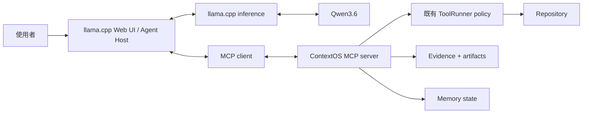

# ContextOS MCP Capability Server

繁體中文 · [English](MCP_SERVER.md)

版本：0.2.0-dev.6

## 定位

ContextOS 現在是一個遵循標準的本機 MCP capability server。它不代理推論、不擁有對話 transcript、不渲染 Web UI，也不取代 Host 的 reasoning 與 streaming 路徑。

```text
Qwen3.6     = 認知模型
llama.cpp   = 推論 Runtime + 主要 Web UI / Agent Host
ContextOS   = 可信任 MCP capabilities + Context Policy Engine
Repository  = 可變的 source of truth
```



Host 擁有 conversation history。ContextOS 擁有一個選定的 project root、一個 `MemoryStore`，以及一條工具／證據 authority boundary。

## 相容性決策

第一個 transport 採標準 MCP stdio。llama.cpp `b10295` 可讀取 Cursor-compatible `mcpServers` JSON，支援 `command`、`args`、`env`、`cwd`、`timeout_ms`，並把 MCP server 啟動成子程序；其協定版本是 MCP `2024-11-05`。ContextOS 使用官方 TypeScript MCP SDK 1.30.0，並對這個確切版本做 protocol smoke test。

主要依據：

- [llama.cpp b10295 server options](https://github.com/ggml-org/llama.cpp/blob/b10295/tools/server/README.md)
- [llama.cpp b10295 MCP transport](https://github.com/ggml-org/llama.cpp/blob/b10295/tools/server/server-mcp.cpp)
- [官方 MCP TypeScript SDK](https://github.com/modelcontextprotocol/typescript-sdk)

llama.cpp `b10295` 透過 `/tools` 整合使用 MCP tools。ContextOS 也實作 MCP resources，供支援 resources 的其他 Host 使用；llama.cpp 整合本身不依賴 resources。

## Runtime 邊界

MCP adapter 刻意維持很薄：

```text
MCP request
  -> 官方 MCP SDK validation
  -> 既有 ToolRunner
  -> 既有 containment / policy
  -> 既有 ToolEvidenceManager
  -> machine-readable MCP result
```

`src/mcp-tools.js` 不直接呼叫 `fs.readFile`，也不直接建立 process。Repository 操作仍經過 `src/tools.js`；artifact 持久化與 recovery 仍經過 `ToolEvidenceManager` 與 `MemoryStore`。

## Tool surface

預設 `read-only` 模式只公布六個既有工具：

| 工具 | 能力 |
| --- | --- |
| `read_file` | 讀取選定 project 內的有限行數 |
| `file_glob_search` | 比對 repository 路徑 |
| `grep_search` | 在 repository 內執行有上限的文字搜尋 |
| `read_working_state` | 讀取 state、project memory、episodes 與 artifact metadata |
| `read_artifact` | 透過 integrity validation 取回有限的 durable evidence |
| `get_datetime` | 取得本機與 UTC 時間 |

只有顯式 `trusted-local` 模式會再公布：

| 工具 | 能力 |
| --- | --- |
| `write_file` | 建立或覆寫 project file |
| `edit_file` | 執行精確文字替換 |
| `run_command` | 僅在 `security.allowCommands` 也為 true 時執行受保護命令 |
| `build_repo_map` | 重建 derived repository map |
| `update_working_state` | 持久化 derived continuation state |
| `save_episode` | 持久化可重用 episodic memory |

名稱與 schema 都來自既有 `TOOL_DEFINITIONS`；本 milestone 沒有創造平行 alias，也沒有第二套 filesystem implementation。

## Resource surface

Resources 全部是 read-only、bounded、Runtime-derived、machine-readable：

| URI | 內容 |
| --- | --- |
| `contextos://repository/map` | 現有持久化 repository map |
| `contextos://memory/project` | 人類可編輯的 project memory |
| `contextos://state/working` | Derived continuation state |
| `contextos://artifacts` | 有上限的 artifact metadata index |
| `contextos://artifacts/{artifactId}` | 通過完整性驗證的 artifact content |

Private transcript/session files 不會成為 resource。預設 response ceiling 是 128 KiB；若超過，回覆仍是合法 JSON，並帶有 `truncated`、`originalBytes` 與 bounded preview。

## Evidence contract

每個已執行 MCP tool result 都會通過 `ToolEvidenceManager`。達到既有 persistence threshold 的結果會產生 durable artifact；超過 render limit 的結果只回傳 recovery preview，不會把整份輸出重新塞回模型 context。

```json
{
  "schemaVersion": 1,
  "ok": true,
  "tool": "read_file",
  "result": {},
  "error": null,
  "evidence": {
    "durable": true,
    "artifactId": "read_file-...",
    "sha256": "...",
    "recoveryType": "artifact",
    "originalChars": 2345,
    "resultStatus": "ok"
  }
}
```

Repository 或 artifact 才是 source of truth；MCP response 只是 transport representation，不會替自己取得 authority。

## Mutation 安全

預設是 `read-only`。Mutation tools 不會出現在 tool list；嘗試呼叫未公布 mutation 時，MCP layer 會 fail closed。

這裡的 read-only 是指不提供 repository source／state mutation capabilities。ContextOS 仍會初始化 `.qwen-agent/`，而 read operation 產生的 durable evidence 也可能持久化；這種 internal recovery write 屬於既有 evidence contract。

`trusted-local` 必須在 `config/mcp.json` 或 `--mode trusted-local` 顯式指定。因為 stdio 沒有互動式 approval channel，它會開啟 non-interactive auto-approval；但仍不能繞過：

- selected-project real-path containment；
- symbolic-link 與 Windows-junction escape checks；
- destructive-command denial；
- `security.allowCommands`；
- command timeout；
- evidence generation。

除非確實需要命令執行，否則保持 `security.allowCommands: false`。不要把 llama.cpp agent/MCP 功能暴露到 LAN 或不受信任的 browser origin。

## 設定

`config/mcp.json` 與 llama.cpp model/inference 設定完全分開：

```json
{
  "schemaVersion": 1,
  "projectRoot": "../workspace",
  "mode": "read-only",
  "maximumResourceBytes": 131072,
  "artifactPolicy": {
    "artifactPersistenceChars": 800,
    "maxToolOutputChars": 12000,
    "staleToolCompressionChars": 800,
    "staleToolPreviewChars": 500
  },
  "security": {
    "allowCommands": false,
    "commandTimeoutSeconds": 120
  }
}
```

`00_setup.bat` 會安裝 lockfile 固定的 dependencies、建立這份 local config，並以絕對 Node／ContextOS 路徑產生 `config/llama-mcp.json`。Host config 的結構如下：

```json
{
  "mcpServers": {
    "context-os": {
      "command": "C:\\Program Files\\nodejs\\node.exe",
      "args": [
        "C:\\path\\to\\context-os\\src\\mcp-server.js",
        "--config",
        "C:\\path\\to\\context-os\\config\\mcp.json"
      ],
      "cwd": "C:\\path\\to\\context-os",
      "timeout_ms": 30000
    }
  }
}
```

## 與 llama.cpp 一起啟動

```text
00_setup.bat
編輯 config\mcp.json
01_start_server.bat
開啟 http://127.0.0.1:8080
```

只要 `config/llama-mcp.json` 存在，`01_start_server.bat` 就會加入：

```text
--mcp-servers-config <absolute-config-path>
```

它不會啟用 llama.cpp 內建 tools、`--agent` 或 browser MCP CORS proxy，避免平行 capability path 繞過 ContextOS policy。

既有 `02_start_agent.bat` 仍可啟動 standalone `AgentRuntime` CLI；它是選配，不屬於 MCP transport。

## 直接啟動 MCP

其他本機 MCP Host 可以直接啟動：

```powershell
node src/mcp-server.js --project C:\Projects\my-app
```

顯式開啟 trusted local mutation：

```powershell
node src/mcp-server.js --project C:\Projects\my-app --mode trusted-local
```

Diagnostics 只寫 stderr；stdout 完全保留給 MCP NDJSON frames。

## Context Policy Engine 邊界

Frozen M4 planner identity 與 D0-D6 execution semantics 完全不變。它們仍作為 Context Policy Engine 存在，但這個 milestone 不把它接進 Host transcript：

```text
本版已實作：
MCP Host -> MCP Capability Server -> tools/evidence/memory/repository

本版未實作：
MCP Host transcript -> ContextInventory -> D0-D6 改寫 Host context
```

這能避免假裝 MCP server 擁有或能暗中改寫 llama.cpp conversation history。

## 驗證

```powershell
npm test
npm run test:mcp
node src/mcp-server.js --help
```

測試涵蓋官方 SDK negotiation、llama.cpp `2024-11-05` initialize flow、精確 tool lists、resources、ToolRunner containment、durable evidence、artifact recovery、read-only mutation rejection、顯式 trusted-local、malformed calls、auxiliary corruption，以及 frozen M4 manifest。

Windows Application Control 仍可能封鎖 `llama-server.exe` 本身。遇到時應依本機安全政策驗證或解除該可信 binary 的封鎖，不要全面關閉系統保護。
